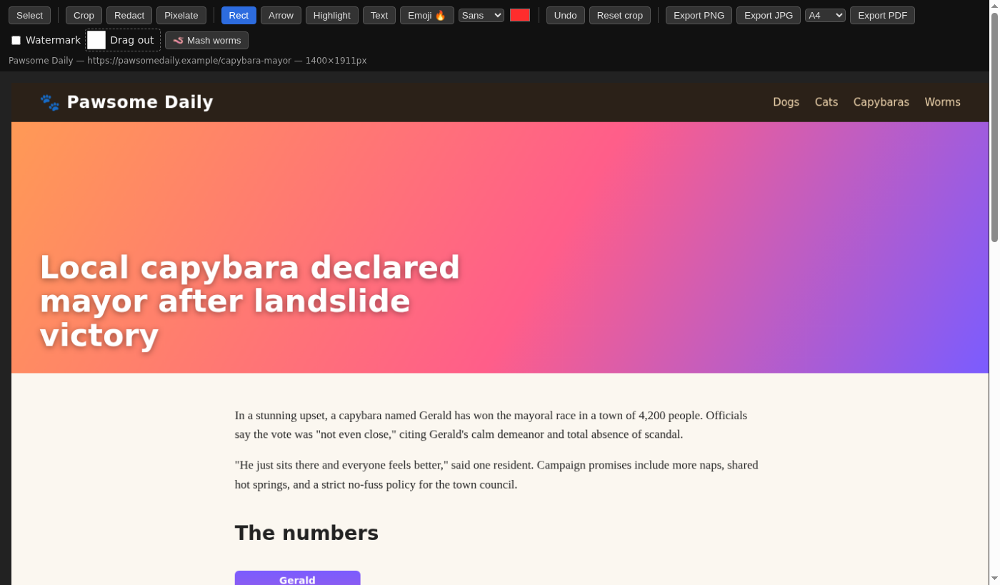
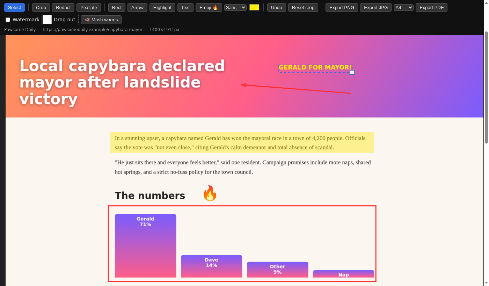
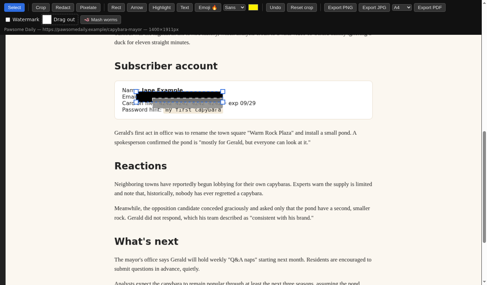
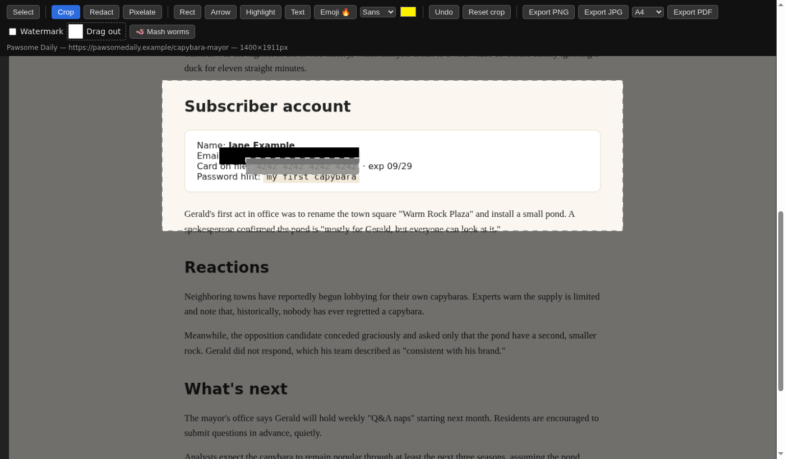
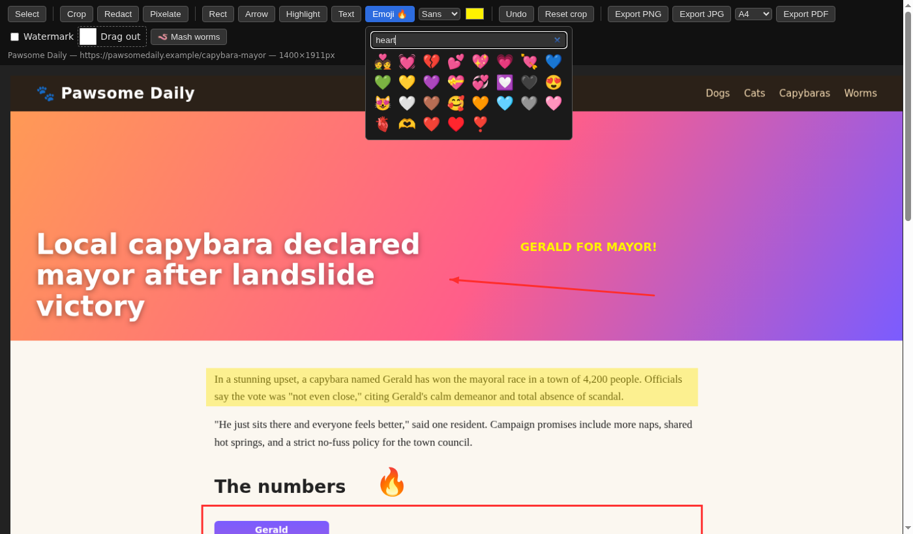
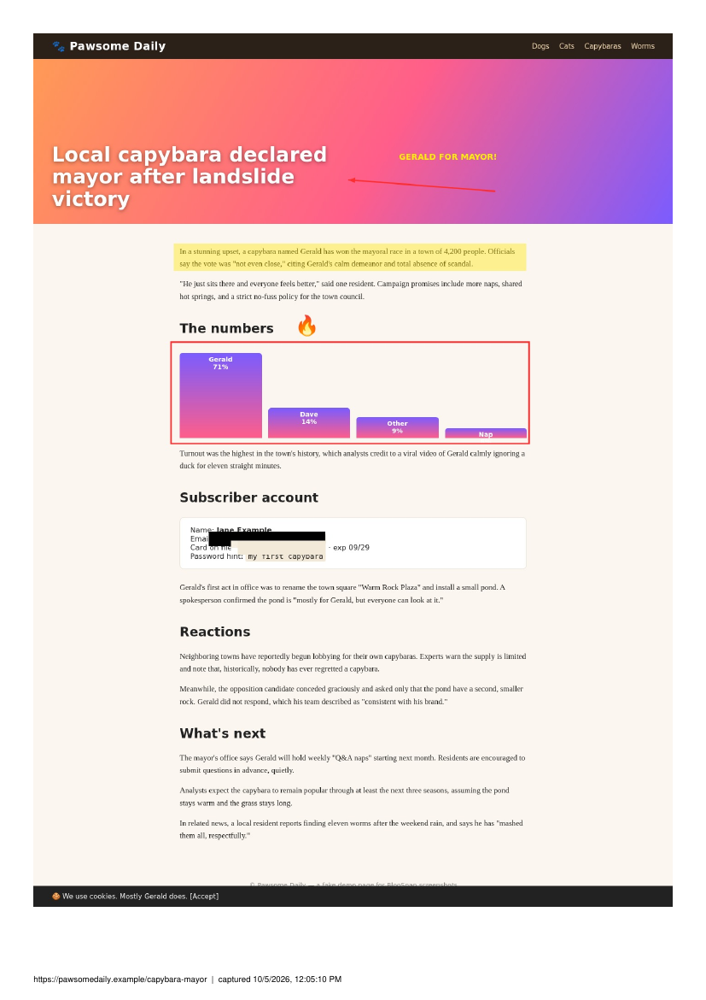
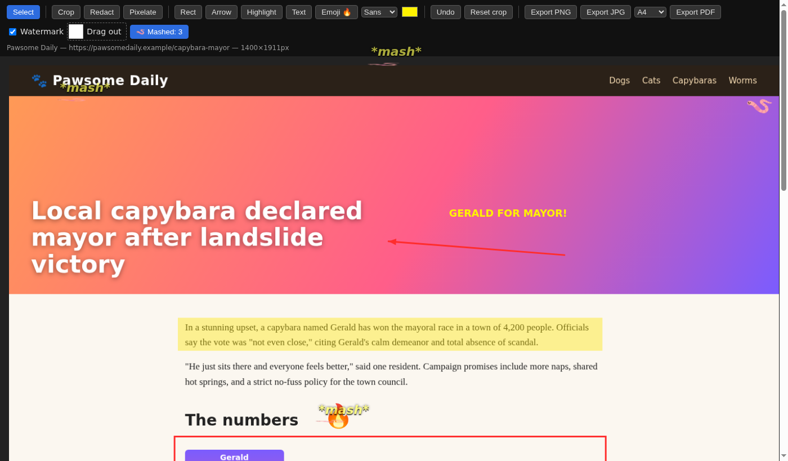

# BlooSnap

Brave/Chrome (Manifest V3) extension: full-page capture with a small built-in editor.

## Install (unpacked)
1. Open `brave://extensions` (or `chrome://extensions`), enable Developer mode.
2. Load unpacked → pick this folder.
3. Click the toolbar icon or press **Alt+Shift+S** (rebind at `brave://extensions/shortcuts`).

## What it does
- Scroll-and-stitch capture; handles sticky/fixed bars, lazy-loaded content, inner scrollers and same-origin iframes. Oversized pages split into tiles (canvas limit).
- Editor: crop, redact (black / pixelate), rect, arrow, highlight, text (fonts), emoji (searchable), select/move/resize/delete, undo.
- Export PNG / JPG / PDF (A4, Letter, Legal; page breaks fall in whitespace), optional URL + date watermark, drag the image out of the tab.
- Permissions: `activeTab`, `scripting` only.

## Screenshots
Captured with BlooSnap itself on a fake demo page.

| | |
|---|---|
| **Full-page capture** — scroll, stitch, one image<br> | **Annotate** — arrow, highlight, rect, text, emoji; select to move/resize<br> |
| **Redact** — black box and pixelate (flattened on export)<br> | **Crop** — click Crop again to remove it<br> |
| **Emoji search**<br> | **PDF** with URL + date watermark<br> |
| **Mash worms** — family lore, 1 worm/sec<br> | |

## Layout
| File | Role |
|---|---|
| `background.js` | Capture: measure, scroll, `captureVisibleTab`, stitch into tiles, store in IndexedDB |
| `db.js` | IndexedDB helpers (captures are too big for `chrome.storage`) |
| `editor.html` / `editor.js` | Editor UI; annotations in image-pixel space, flattened on export |
| `pdf.js` | Dependency-free PDF writer (one JPEG per page) |
| `emoji-data.js` | Generated emoji search list (Unicode names + aliases) |
| `bloosnap.md` | Original feature wishlist |
| `tools/screenshots/` | Regenerates `docs/screenshots` by driving the real extension in headless Brave (see below) |

## Known gaps
- Cross-origin iframes can't be scrolled (`activeTab` limit).
- PDF text isn't selectable (pages are images).
- Crop can't be resized after drawing; no progress UI during export.
- Only tested by hand; no automated tests.

## Regenerate the screenshots
```
pip install websockets          # plus poppler (pdftoppm) and Brave/Chromium
python3 tools/screenshots/run.py [--out DIR] [--brave "flatpak run com.brave.Browser"]
```
It copies the extension to a temp dir, serves a fake demo page, runs the extension's real capture code against it, then scripts the editor and writes the PNGs. It picks free ports, uses a throwaway profile, cleans up after itself, and aborts if headless Brave serves stale frames.

## Package
`./package.sh` → `dist/bloosnap-<version>.zip`

## License
MIT — free for anyone to use, modify, and share. See [LICENSE](LICENSE).
